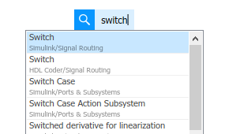
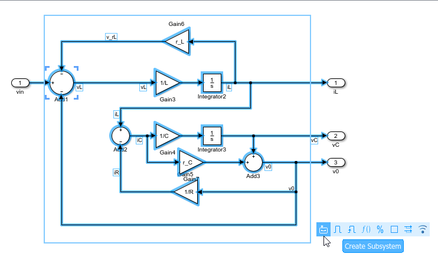
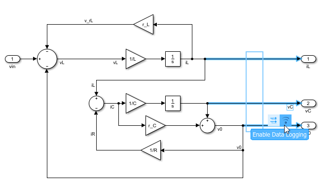
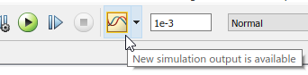
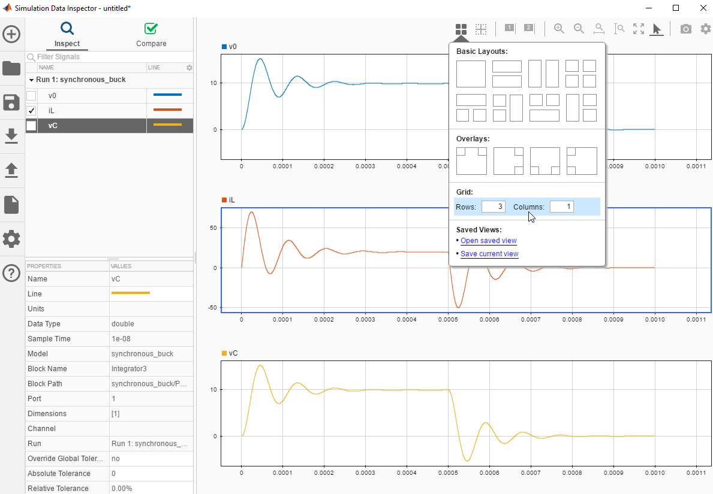

#### Simulink tips

1. Search: searching for block if the name is known.  
For example: swicth block.  
Double click on the simulink white canvas and start typing the keyword you are looking for-->'switch'  
  

2. Create a subsyste: For creating a subsystem, 
   1. Select the needed blocks as shown in the lecture. 
   2. Leave the mouse button, there will be some options displayed at the right bottom corner that can be applied to oyur selection.
   3. Select create a subsystem
     

3. Data logging: A powerful tool to analyze simulation results is Data Logger. 
   1. Select the signals of interest by drag selection
   2. Seletc the option enable data logging ( the symbol that looks like WiFi)
     
   3. Once the simulation is done, data logger appears highlighted, indicating that there are some signals in your simulation that are logged in data logger.
     
   4. Opening the data logger to view simulation results gives lots of possibilities for analysis, plot them into desired layouts, import, export, compare between various simulation runs etc.  
     

