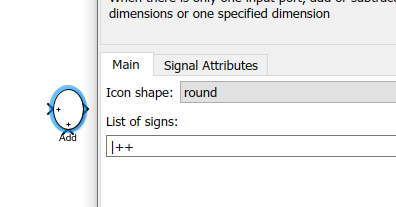

#### Power Electronics and Control from Prof. Kapat (IIT Kharagpur)
This repo contains some lecture notes, simulation models from the lectures of Prof. Kapat.  
PE_1: https://onlinecourses.nptel.ac.in/noc22_ee100/preview  
PE_2: https://onlinecourses.nptel.ac.in/noc22_ee124/preview  

##### Simulink tips

1. Search: searching for block if the name is known.  
For example: swicth block.  
Double click on the simulink white canvas and start typing the keyword you are looking for-->'switch'  
  

2. Create a subsyste: For creating a subsystem, 
   1. Select the needed blocks as shown in the lecture. 
   2. Leave the mouse button, there will be some options displayed at the right bottom corner that can be applied to oyur selection.
   3. Select create a subsystem
     

3. Data logging: A powerful tool to analyze simulation results is Data Logger. 
   1. Select the signals of interest by drag selection
   2. Seletc the option enable data logging ( the symbol that looks like WiFi)
     
   3. Once the simulation is done, data logger appears highlighted, indicating that there are some signals in your simulation that are logged in data logger.
     
   4. Opening the data logger to view simulation results gives lots of possibilities for analysis, plot them into desired layouts, import, export, compare between various simulation runs etc.  
     

4. Update model:  'Ctrl + D' is something I use very frequently. This is update model which shows error and warnings if any before running simulation. 

5. Show data types: This is another useful feature if you are dealing with different datatypes in your model. This is relavant if you have datatypes other than double (default matlab datatype for simulations). If you are for example intending to do code generation and have prepared your model with single/ double precision floating point datatypes or if you have fixed-point datatypes or booleans etc, this will help a lot to see them at the input and output of the blocks.  
  
  
Note that in newer versions, this option would be located at a different location.  

6. Add block:  Modifying the input ports of the Add block as needed without rotating it can be done as below. The first input port always starts from the top. Then further inputs are assigned in counter-clockwise direction.  

Rectangular / Round shape can be selected here.  

By default the two input ports are shown as below.  
Inserting a 'pipe' in the front will create an empty space at the top.  
  
If a - port to be inserted at the top, the 'pipe' can be replaved with '-'. Similary you canplay around with the location of the 'pipe' symbol to move your input ports. You can add more pipes as desired.  
  

7. Model properties: Callbacks  
Callbacks can be used to call your matlab code/ m-files in various phases of your model open, execute, start, stop, close etc. instants.  
For example, to execute an .m file before starting simulation, StartFcn callback can be used. Similarly InitFcn, CloseFcn, StopFcn events can be used to initiate desried callbacks.  

8. Model refrencing:  This is similar to having a functionality written in a file. The function can be called upon need which has been residing in that file. Any other file or function can call this function. If the funtionality has to be changed, it is needed to be changed only at one location and it is reflected globally.Similary simulink models can be handled. A model can be called / referenced inside models.  This brings lots of advantages.  

Note: Having algbraic loops in the model that is referenced, will no longer be considered as a warning. It is an error. Solve the algebraic loops before referencing it in other models.  

9. Matlab command open_system('<model_name>'); to open the model.  
10. sim('<model_name>'); to run the model.  
11. 

