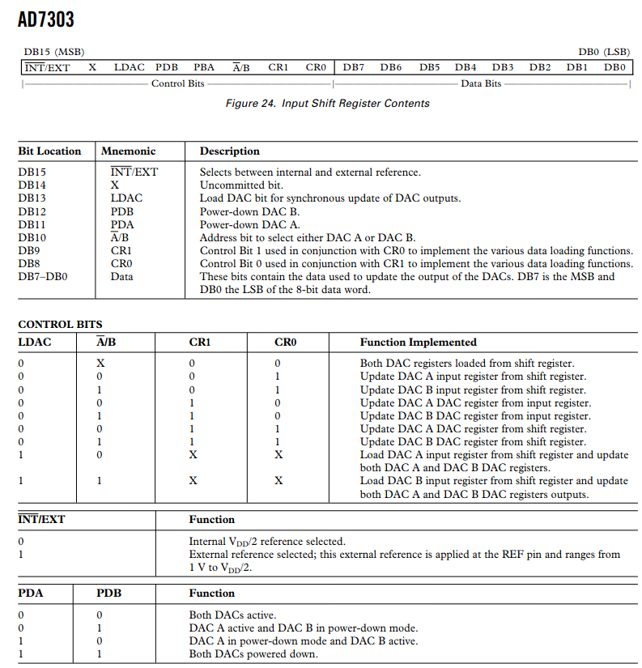

#### SPI Controller for AD7303 DAC
Datasheet: [AD7303](https://www.analog.com/media/en/technical-documentation/data-sheets/AD7303.pdf)  

##### Background:
I would like to walkthrough how I have put this RTL design up for SPI Master controller to be able to speak to AD7303 8-bit DAC peripheral.  
The chip is part of PMOD DA1, that offers two digital outputs. 

From the datasheet we can see that the serail data is sampled on the rising edge of the clock. In the desgined SPI Controller we shift the data on negative edge of the clock. Hence we go with CPOL 0 and CPHA 0.
RTL design and testbench are done in Verilog.  

Reading through the textbook "Verilog By Example" by Blaine C. Readler and lectures from Prof. Adi Teman [1], I have understood desiging a FSM is probably more clean and modular way to structure the HDL design, that could be later easier to debug, maintain and enhance. 

##### Design:
In brief the implemented SPI Controller is just a shift regsiter that keeps shifting each bit from a 16-bit register on to the serial line MOSI, MSB first.

SPI Clock: CMOD S7 has an on-board 12MHz crystal oscillator that could be used in FPGA designs. I have used a clock divider of 6 to derive 2MHz SPI Clock. AD7303 can have clock frequncies as high as 30MHz. I randomly chose 2Mhz here.

The FMS comprises of four states as shown below. 

In the RTL Design we declare them as parameters that would eventually work as 'case' statements.

State transitions happen sequntially on every negedge of SPI Clock. Only in case of state transition from shift_state to idle_state, the design keeps counting the number of bits that are still remaining in the shift register that needs to be shifted on to the setrial line. Once the count reaches 0, we shift the 0th bit, assert done and transit to idle-state. 

idle_state: 
1. Pull chipselect high
2. Transit to load_state

load_state:
1. reset output done signal to 0.
2. load bitcount tracking register to max. number of bits to be shifted-> 4'hF
3. load shift_reg with 8-bit control and 8-bit data bytes.

start_state:
1. chipselect is pulled low
2. shift MSB from the shift_reg on to MOSI line. Like stated earlier, we shift the bit on negedge so that the peripheral can already sample it on the next immediate occuring posedge of the sclk. 
3. shift_reg is left shifted by 1-bit as MSB has already been placed on MOSI.
4. bitcout counter is decremented by 1.
5. transit to shift_state.

shift_state:
1. Keep shifting until the rest of the 15 bits in the shift_reg are shifted on to the MOSI line.
2. keep decrementing bicount tracking regsiter.
3. Assert output signal done and Transit to idle_state after all the bits have been shifted.

##### Note:
The control register is taken as 0x00. This configuration shall keep both the DACs active, loads the data byte that we shifted into the shift registers of both DACs. Therefore we shall see the same output voltage on both the DACs.

The data register is handled as a parameter and given a value of 0x7F.
This shall produce an output analog voltage of 
2*3.3V*(127/256) = 1.63V

##### Testing in Simualation and on Board:
A simple testbench has been written to test this unit. I have used iverilog and gtkwave for testing this in simulation.
I then created a Vivado project to synthesize, implement, generate bitstream and configure the FPGA on CMOD-S7.
Analog Discovery (legacy) was quite handy to verify both the transmtted digital data and converted analog voltage by the PMOD DA1 module.

Transmitted MOSI data:

DAC output from PMOD DA1:

The design has been tested with different data values to check for the correctness of analog output voltages. 
The oscillations in the output voltage can be minimized by connecting a filter capacitor at the DAC output.

HW Setup:

##### Conclusion:
The design shall further be extened to make data byte as input vector so that this RTL module can take it as input from application it goes into.
The similar can be done with control byte as well based on the application needs.