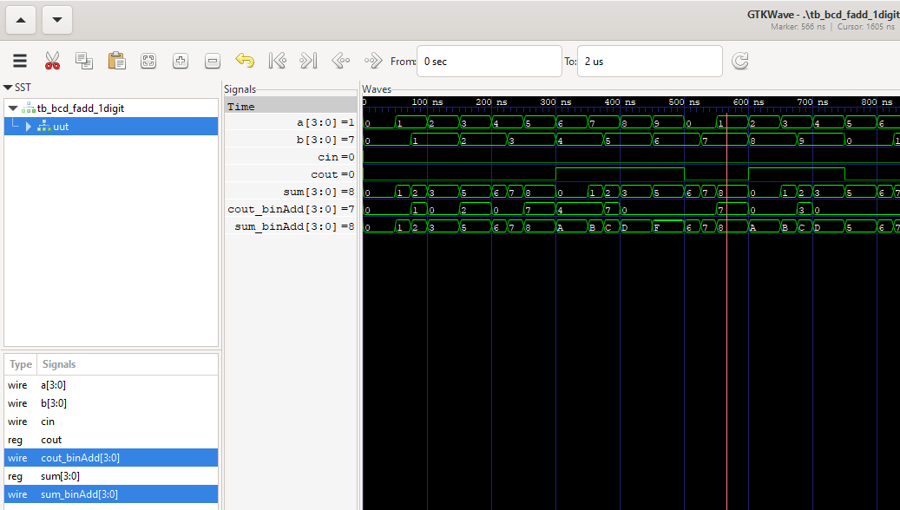

####  1digit BCD Adder 

rtl design and testbench in verilog.  
generate statement is used to instantiate copies of 1bit full addder (fadd.v).  

Verified in iVerilog and GTKWave.  

1digit BCD adder is implemented by instantiating four 1bit full adders.
If the binary addition is greater than 9d, then 6d is added to it (binary sum) to get the BCD sum.  

  
