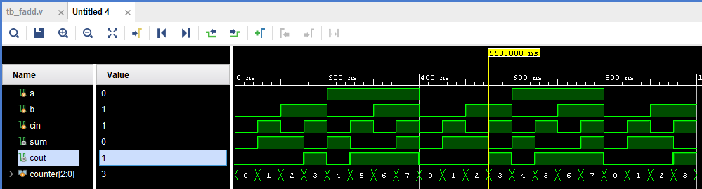
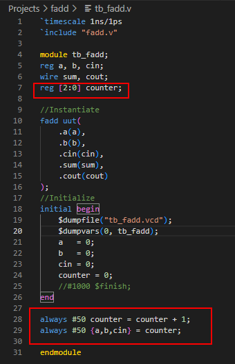

#### 1bit full adder
Exercise: [HDLbits](https://hdlbits.01xz.net/wiki/Fadd)  
rtl and testbench in verilog.  

##### Notes:  
I have learnt to declare new variables in the test bench.  
reg [2:0] counter is a 3bit up counter. It counts up every 50ns. After 50ns from the time it is upcounter, its value is assigned to the input variables a, b,  cin. Note the combined assignemnt operator used.  

  
