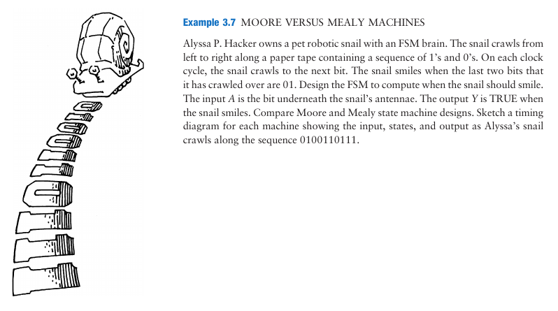
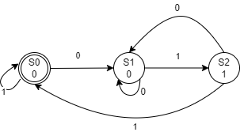

### Solution to the exercise question from the textbook: Digital Design and Computer Architecture from Sarah Harris and David Harris.

#### Introduction: 
This repo contains the source and testbench files in verilog. iverilog is used as a simulator and Gtkwave for visulalization. Yosys is used to synthesize the design. Sky130 PDK's sky130_fd_sc_hd target architecture is used to map to the synthesized design from Yosys.

The FSM State Transition Diagram is drawn.
*   States (circles) are identified.
*   State transions/inputs (lines) are marked.
*   
  
